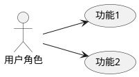
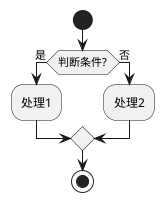
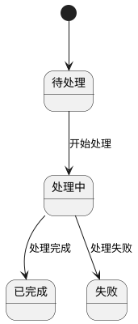
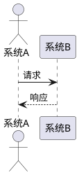
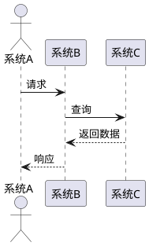

# 技术方案生成器

根据用户提供的输入源（图片/文字/蓝湖链接），自动生成完整的项目技术方案。

## 输入源处理

### 1. 图片输入
当用户提供图片时：
- 使用 `read_file` 工具读取图片内容
- 分析图片中的 UI 设计、流程图、架构图或需求说明
- 提取关键功能点和业务逻辑

### 2. 文字描述
当用户提供文字描述时：
- 分析需求描述，识别核心功能模块
- 提取业务规则、约束条件和交互流程
- 明确技术边界和非功能性需求

### 3. 蓝湖链接
当用户提供蓝湖链接时：
- 使用 `mcp_FramelinkFigmaMCP_get_figma_data` 获取设计稿数据
- 使用 `mcp_FramelinkFigmaMCP_download_figma_images` 下载相关图片资源
- 分析设计稿中的页面结构、组件和交互逻辑

### 4. 复用已有功能识别
当用户提到以下类似话术时，需要检查是否已有现成功能：

**常见话术关键词：**
- "参考XXX系统"、"类似XXX功能"、"沿用XXX的设计"
- "和XXX一样"、"复用XXX的"、"基于XXX改造"
- "对接XXX"、"调用XXX接口"、"集成XXX能力"
- "同步XXX数据"、"共用XXX模块"、"继承XXX逻辑"

**处理步骤：**
- 使用 `search_codebase` 工具搜索相关项目的功能模块
- 使用 `grep_code` 工具查找关键代码实现
- 使用 `lsp` 工具查找接口定义和调用关系
- 分析已有功能的实现方式，避免重复设计
- 在技术方案中明确标注：
  - 【复用】已有功能，无需开发
  - 【改造】基于已有功能扩展
  - 【新建】需要全新开发

## 技术方案模板

生成的技术方案必须严格遵循以下模板结构：

```markdown
# [功能名称] 技术方案

## 一、需求背景
快速理解项目、了解产品需求

## 二、项目原型

| 名称 | 地址 | 备注 |
|------|------|------|
| PRD | | |
| UI | | |
| BUG | | |

## 三、本期目标
本期项目需要达成的目标

| 序号 | 内容 | 说明 |
|------|------|------|
| 1 | | |
| 2 | | |
| 3 | | |

## 四、项目管理
直接放项目管理链接即可

## 五、影响范围

### 业务模块、系统、接口

| 序号 | 内容 | 说明 |
|------|------|------|
| 1 | | |
| 2 | | |

### 生产兼容

| 序号 | 内容 | 说明 |
|------|------|------|
| 1 | 数据库改动 | 兼容/不兼容 |
| 2 | 接口改动 | 兼容/不兼容 |

### 影响面评估
- 是否对线索、订单、用户等核心业务域有影响：
- 对其他依赖应用有什么影响：
- 是否对数据报表有影响：
- 与现在正在开发功能是否有冲突或兼容问题：
- 是否涉及app发版或者老版本兼容问题：

## 六、业务分析

### 1、业务用例
描述用户角色和使用场景（使用 PlantUML 语法）



**Markdown 语法版本：**
- **用户角色1**：使用功能1、功能2
- **用户角色2**：使用功能3

### 2、业务流程
包含流程图（使用 PlantUML 语法）



**Markdown 语法版本：**
1. 开始流程
2. 判断条件
   - 条件成立：执行处理1
   - 条件不成立：执行处理2
3. 流程结束

### 3、业务实体状态图
包含状态图（使用 PlantUML 语法）



**Markdown 语法版本：**
| 当前状态 | 触发事件 | 目标状态 |
|---------|---------|---------|
| 初始状态 | - | 待处理 |
| 待处理 | 开始处理 | 处理中 |
| 处理中 | 处理完成 | 已完成 |
| 处理中 | 处理失败 | 失败 |

## 七、系统设计

### 1、系统开发分支
feature_YYYYMMDD_xxx

### 2、交互时序图
包含时序图（使用 PlantUML 语法）



**Markdown 语法版本：**
| 步骤 | 系统 | 动作 | 目标系统 |
|-----|------|------|---------|
| 1 | 系统A | 发送请求 | 系统B |
| 2 | 系统B | 返回响应 | 系统A |

### 3、应用间交互图
包含应用间调用关系（使用 PlantUML 语法）



**Markdown 语法版本：**
| 步骤 | 系统 | 动作 | 目标系统 | 说明 |
|-----|------|------|---------|------|
| 1 | 系统A | 发送请求 | 系统B | 发起调用 |
| 2 | 系统B | 查询 | 系统C | 获取数据 |
| 3 | 系统C | 返回数据 | 系统B | 返回结果 |
| 4 | 系统B | 返回响应 | 系统A | 最终响应 |

### 4、领域模型
包含 ER 图或领域模型图

### 5、数据模型
#### 表结构定义：
```sql
CREATE TABLE `表名` (
  `id` bigint(20) NOT NULL AUTO_INCREMENT COMMENT '主键',
  ...
) ENGINE=InnoDB DEFAULT CHARSET=utf8mb4 COLLATE=utf8mb4_bin COMMENT='表注释';
```

### 6、缓存设计
- 6.1 key的设计
- 6.2 value的设计
- 6.3 缓存更新策略

### 7、消息设计
- 7.1 消息体
- 7.2 幂等处理方案

### 8、定时任务
定时任务的流程图、执行周期、必要性

## 八、接口设计

### 1、B端接口

| 名称 | 接口地址 | 备注 |
|------|---------|------|
| | | |

### 2、C端接口

| 名称 | 接口地址 | 备注 |
|------|---------|------|
| | | |

## 九、非功能性设计

### 1、权限影响
评估是否需要新增、修改、删除权限相关配置

### 2、数据清洗/迁移
相关说明

### 3、灰度方案/黑白名单
相关说明

### 4、安全评估
是否涉及手机等敏感信息
```

## 执行步骤

1. **需求分析**
   - 识别输入源类型
   - 提取功能需求和业务规则
   - 明确技术约束
   - **检查已有功能**：如果用户提到参考已有项目，搜索代码库确认功能是否已存在

2. **架构设计**
   - 根据项目技术栈选择合适的技术方案
   - 设计模块划分和依赖关系
   - 规划数据流和接口边界

3. **方案生成**
   - 按模板结构生成技术方案
   - 包含必要的代码示例和 SQL 语句
   - 绘制关键流程图（使用 PlantUML）

4. **方案确认**
   - 向用户展示生成的方案
   - 根据反馈进行调整和完善

5. **输出文件**
   - 将最终方案保存为 Markdown 文件
   - 文件命名格式：`{功能名称}_技术方案.md`
   - 保存路径：用户当前打开的目录（通过 `<current_open_file>` 上下文获取）

6. **上传到Confluence（可选）**
   - 如果用户提供了Confluence页面链接，使用 `Agent` 工具启动浏览器子代理
   - 浏览器代理将执行以下操作：
     1. 导航到指定的Confluence页面
     2. 如需登录，等待用户登录（浏览器会话保持登录状态）
     3. 点击"编辑"按钮进入编辑模式
     4. 将技术方案内容粘贴到页面中
     5. 保存页面
   - 用户需要提供：Confluence页面URL
   - 示例话术：`上传到 https://xtconfluence.xuetian.cn/pages/viewpage.action?pageId=xxx`

## 注意事项

- 生成方案时应参考项目现有的技术栈和架构规范
- 数据库设计需遵循项目已有的表命名和字段命名规范
- 接口设计应符合项目 RESTful API 规范
- 涉及到现有模块变更时，需评估影响范围
